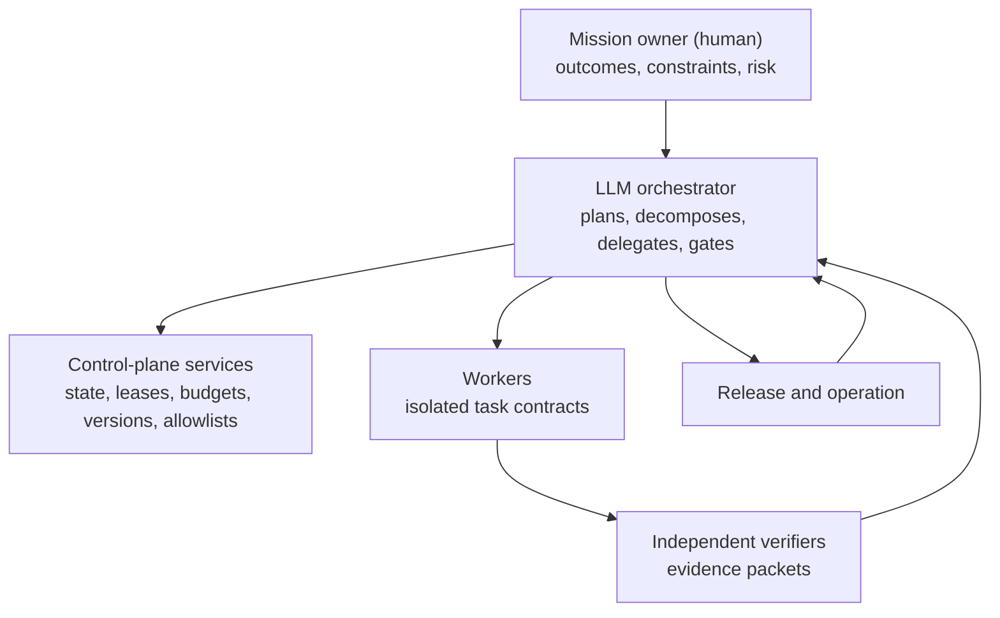

# Agentic Software Factory: A First-Principles Operating Model (Merged Edition)

*Goal decomposition, task allocation, coordination, and verification — synthesis of two independent research passes, with resolved design decisions recorded in the final section.*

---

## TL;DR

- **Build a supervisor/orchestrator-worker "software factory."** The strongest 2025–2026 evidence — Google Research's 180-configuration study, Anthropic's production research system, Cursor's FastRender case study, and the MAST failure taxonomy — converges on one design: a capable LLM orchestrator that decomposes work, delegates spec-bounded tasks to cheaper specialized workers, and enforces independent verification at every phase boundary. In Google Research's controlled study, centralized coordination contained error amplification to ~4.4x versus ~17.2x for uncoordinated agents, and improved performance by ~81% on parallelizable work.
- **The dominant failure cause is organizational, not model quality.** Across 1,642 annotated traces (Cemri et al., NeurIPS 2025), roughly 42% of multi-agent failures are specification/system-design defects, ~37% inter-agent misalignment, and ~21% verification gaps — the exact failure classes that NASA systems engineering, Malone & Crowston coordination theory, GORE/KAOS, and CMMI were built to prevent. Better base models do not fix a broken operating model.
- **The factory is a risk-aware, evidence-gated executor of dependency graphs, not a simulated software company of chatty personas.** In one sentence: *recursively convert intent into proof obligations and product interfaces, schedule only genuinely independent work in parallel, assign each unit to the agent with the highest expected utility, and accept changes only when independent evidence closes the traceability loop.*
- **Verify against the original goal, not agent-generated proxies, and treat economics as a first-class design problem.** Per-step reliability compounds (0.95²⁰ ≈ 36% end-to-end success), so the core discipline is spec-driven decomposition + multi-level independent verification + a MAPE-K control loop with explicit stopping criteria — under token budgets that the orchestrator actively manages.

---

## First-Principles Foundation

Five premises drive the design:

1. **Success is a state of the world, not completion of an activity.** "Implemented feature X" is insufficient; completion must be expressed as measurable behavior in an operational scenario.
2. **Software work has dependencies.** Coordination is therefore not synonymous with communication. Malone & Crowston's definition — "managing dependencies among activities" — covers shared resources, producer–consumer flows, synchronization, and task/subtask relations ([The Interdisciplinary Study of Coordination](https://crowston.syr.edu/sites/default/files/acmcs94.pdf)).
3. **Agents are bounded and probabilistic.** They lose information through context compression, make correlated mistakes, vary between runs, and may stop too early or continue too long.
4. **Verification is itself fallible.** A test can encode the same misunderstanding as the implementation, and an LLM reviewer can inherit the implementer's assumptions.
5. **Parallelism has a coordination tax.** More agents provide additional search, context, and compute, but also introduce handoffs, duplicated context, integration work, contention, and error propagation.

The resulting objective is approximately:

> **maximize** E[stakeholder value] − λ·(compute cost) − μ·(delivery time) − ν·(failure risk) − κ·(coordination cost)

subject to security, budget, schedule, compliance, and human-authority constraints. The quantity being optimized is **verified stakeholder value** — not agent utilization, commits, messages, token count, or completed tickets. This objective function is why economics is promoted to a first-class problem (Problem 8 below): the λ and κ terms are architectural variables, not operational afterthoughts.

---

## The Eight Coupled Problems

### Problem 1 — Objective: what measurable outcome represents completion?

**Classical grounding.** NASA's systems engineering model frames every effort as a recursive descent from *stakeholder expectations → requirements → logical decomposition*, closed by *verification* (built right?) and *validation* (right thing built?) ([NASA SE Fundamentals](https://www.nasa.gov/reference/2-0-fundamentals-of-systems-engineering/), [product verification](https://www.nasa.gov/reference/5-3-product-verification/), [product validation](https://www.nasa.gov/reference/5-4-product-validation/)). GORE/KAOS refines high-level goals via AND/OR decomposition until each terminal goal is *assignable to a single agent* and expressed as monitorable, controllable conditions; it also contributes obstacle analysis — systematically generating the ways a goal can fail before execution ([KAOS overview](https://webperso.info.ucl.ac.be/~avl/gore.php); van Lamsweerde & Letier, IEEE TSE 2000).

**Modern practice.** The completion criterion must be an *external, goal-level* acceptance test, not an agent-authored proxy. MAST's most damaging insight is that verifier agents routinely check surface conditions (does it compile?) while missing whether the artifact satisfies intent. Kiro operationalizes objective-setting through EARS syntax ("WHEN [condition] THE SYSTEM SHALL [behavior]"), yielding testable acceptance criteria that enable property-based testing downstream.

**Prescription.** Encode the objective as: (a) a versioned specification with EARS-style acceptance criteria and measures of effectiveness; (b) an explicit obstacle/risk list (KAOS); (c) a machine-checkable end-state evaluation owned by an independent verifier; and (d) a **predeclared proof method for every requirement** — test, analysis, inspection, demonstration, or a justified combination — chosen *before* implementation so the implementation does not define its own notion of success. Anthropic's system uses LLM-as-judge against a rubric plus end-state evaluation rather than step-by-step path matching — measure outcomes, not paths.

### Problem 2 — Decomposition: what work products are necessary and sufficient?

**Classical grounding.** NASA's logical decomposition and HTN planning (compound tasks recursively reduced into primitive tasks connected by ordering and constraint relations — [Erol, Hendler & Nau](https://www.cs.umd.edu/~nau/papers/erol1994umcp.pdf)) are canonical. SharedPlans (Grosz & Kraus 1996) and joint intentions (Cohen & Levesque) formalize how a group elaborates a *partial* plan toward completion. Spec Kit's constitution→specify→plan→tasks and BMAD's story-sharding are direct descendants.

**Maintain four linked graphs, not one task list:**

| Graph | Question | Typical nodes and edges |
|---|---|---|
| Goal/requirement graph | Why must this exist? | objectives, scenarios, constraints, AND/OR refinements, assumptions, obstacles |
| Product/interface graph | What must work together? | services, modules, schemas, APIs, ownership boundaries |
| Execution graph | What work happens, in what order? | tasks, preconditions, artifacts, dependencies, resources |
| Assurance graph | What proves that it works? | acceptance criteria, tests, analyses, reviews, operational evidence |

The critical trace runs: *stakeholder expectation → goal → requirement → design element → task/change → verification evidence → operational validation*. Do not translate a product vision directly into coding tickets — that skips requirements, architectural allocation, interface definition, and proof design, which is exactly where omissions and incompatible parallel work originate.

**Goal decomposition procedure (KAOS-style).** For each goal: express the intended observable outcome and measures of effectiveness; add scenarios, non-goals, environmental assumptions, and constraints; refine with AND children (all required) or OR alternatives (any one strategy suffices); identify obstacles and failure conditions; turn leaf goals into measurable requirements; choose a verification method before implementation; allocate requirements to product elements; only then derive executable tasks.

**A leaf task is ready when it has:** one accountable owner; pinned input versions; bounded scope and write ownership; explicit preconditions and effects; stable interface references; a deliverable that can be independently inspected; acceptance criteria; and a feasible budget with an escalation rule.

**A caveat on completeness.** "Complete decomposition" cannot generally be proved for open-world stakeholder intent. Treat it as an **assurance argument** supported by scenario coverage, AND/OR reasoning, obstacle analysis, hazard analysis, traceability queries, and independent review.

**Modern evidence.** Decomposition is where the plurality of failures originate (MAST FC1, ~42%). The finite context window is the fundamental first-principles reason to decompose at all. Anthropic's guidance: decompose into subtasks with clear objectives, output formats, tool guidance, and boundaries — without which agents duplicate work or leave gaps. Persist every work product as a filesystem artifact (the anti-"game-of-telephone" pattern): subagents write to shared storage and return lightweight references rather than lossy summaries.

### Problem 3 — Dependency graph: what runs concurrently, what must wait?

**Classical grounding.** This is precisely Malone & Crowston coordination theory, plus OR machinery: DAG scheduling, critical path, WIP limits, theory of constraints, queueing.

**Modern evidence.** The Google 180-configuration study ("Towards a Science of Scaling Agent Systems," [research.google blog](https://research.google/blog/towards-a-science-of-scaling-agent-systems-when-and-why-agent-systems-work/), arXiv 2512.08296) proves task decomposability is the master variable: Finance Agent (decomposability D=0.41) gained +80.9% under centralized coordination; PlanCraft (D=0.42, near-identical complexity) *lost* 70% because of strict sequential dependencies. All multi-agent variants degraded sequential-reasoning tasks by 39–70%, and **tool-heavy tasks suffered a disproportionate coordination penalty**. Capability saturation set in (β=−0.408, p<0.001) once single-agent baseline accuracy exceeds ~45%.

**Fan-out rule.** Parallelize only when:

> E[critical-path reduction + search diversity + independent error reduction] > E[context duplication + communication + integration + error propagation + extra compute]

*Good fan-out candidates:* independent repository reconnaissance; alternative architecture proposals; separate components behind stable contracts; platform-specific implementations; independent test or threat generation; documentation/migration/implementation work with frozen interfaces.

*Poor candidates:* debugging a single evolving execution state; changes spanning a highly coupled invariant; tasks requiring constant shared context; sequential migrations; design work where every discovery changes all other branches.

**Prescription.** Build an explicit DAG. Parallelize independent branches; keep producer/consumer chains inside a single agent/context where possible. Assign each Malone–Crowston dependency type a coordination mechanism (see Problem 5's table).

### Problem 4 — Allocation: which agent, model, tools, context own each task?

**Classical grounding.** The Contract Net Protocol ([Smith 1980](https://www.eecs.ucf.edu/~lboloni/Teaching/EEL6788_2008/papers/The_Contract_Net_Protocol_Dec-1980.pdf)) — manager announces, contractors bid, manager awards — plus coalition formation and computational organization theory (Galbraith's information-processing view, Mintzberg structures: hierarchy vs decentralization is a function of coordination cost and information-processing load).

**Modern evidence.** Model-tier heterogeneity is standard: a capable orchestrator (Opus-class) with cheaper specialized workers. Anthropic: Opus 4 lead + Sonnet 4 subagents outperformed single-agent Opus 4 by 90.2% on their internal research eval. Cost routing to cheaper tiers consistently yields ~40–60% cost reductions (directional; depends on traffic mix). Counter-evidence that complexity must earn its cost: the deliberately simple **Agentless** pipeline — localize, repair, validate — was competitive with far more complex software agents ([arXiv 2407.01489](https://arxiv.org/abs/2407.01489)).

**A practical allocation score** for task *i* and agent *a*:

> S(i,a) = P(accept | i,a)·V(i) − C(i,a) − λ·L(i,a) − μ·H(i,a) − ν·R(i,a)

where C is execution cost, L expected lateness, H handoff/coupling cost, and R security/failure risk. Recompute allocation when agents fail, estimates change, interfaces move, or new evidence arrives. Contract-net-style bidding suits a large, heterogeneous, dynamically available pool; static capability routing is simpler when the pool is small.

**Prescription.** Match task difficulty to the cheapest model that clears the quality bar; reserve the frontier model for the orchestrator and genuinely hard leaves. Give each worker a four-part contract (objective, boundaries, output format, tools/sources). Isolate context per worker — *partial* context is worse than none, because an agent with fragmentary context confidently produces work contradicting the parts it never saw.

### Problem 5 — Coordination: interfaces, decisions, conflicts, handoffs

**Classical grounding.** Coordination theory; distributed/team cognition (common ground, shared mental models, transactive memory — [Ryan & O'Connor](https://doras.dcu.ie/18635/1/RyanAndOConnorIST.pdf) describe transactive memory in software teams as a cooperative division of labor for learning, remembering, and communicating knowledge); blackboard architectures; stigmergy. SEMAP's central claim: reliable multi-agent coordination needs classical SE abstractions — behavioral contracts (pre/postconditions), typed structured messaging, lifecycle-guided execution with verification gates ([arXiv 2510.12120](https://arxiv.org/pdf/2510.12120); up to 69.6% failure reduction).

**Modern evidence.** Inter-agent misalignment is ~37% of failures (MAST FC2). Cursor's FastRender is the definitive case study: equal-status peers with locking collapsed (20 agents throttled to throughput of 2–3); optimistic concurrency made agents risk-averse; the working design was hierarchical — Planners create tasks (and spawn sub-planners), Workers execute in isolation and push, a Judge decides whether each cycle continues — with version control as shared memory. Standard protocols (A2A, MCP) help with plumbing but not the underlying social-reasoning failures.

**Architecture: LLM orchestrator on top, deterministic enforcement services beneath.** The capable LLM orchestrator holds top-level planning and delegation authority (supervisor topology — the 2026 production default). It commands a deterministic **control-plane service layer** that mechanically enforces what the orchestrator decides:

- workflow state and legal state transitions — a task state machine: `draft → ready → leased → running → submitted → verifying → accepted`, with side transitions to `blocked`, `rework`, `cancelled`, `escalated`;
- task leases and exclusive write ownership; dependency readiness;
- artifact and requirement versions; access permissions and tool allowlists;
- time, token, and monetary budgets; retry and escalation limits;
- event logs, checkpoints, gate results, deployment authority.

Worker agents may *recommend* a transition; they cannot declare themselves accepted or bypass a policy gate — acceptance flows through the orchestrator's verification gates enforced by these services.

**Roles map to actual authority, not persona prompts:**

| Role | Authority |
|---|---|
| Mission owner (human) | Accepts goals, trade-offs, residual risk, production release |
| LLM orchestrator | Top-level planning, decomposition, delegation, gate decisions informed by verifier evidence |
| Worker | Owns a bounded artifact or change set |
| Interface/integration owner | Controls baselines, interfaces, integration order |
| Verifier | Accepts or rejects evidence; never silently repairs the work being assessed |
| Control-plane services | Mechanically enforce prerequisites, permissions, budgets, transitions |

For low-risk work, one agent can fill several roles sequentially. High-impact changes enforce maker–checker separation and, where warranted, human or organizational independence (NASA defines IV&V as assessment independent of the developer — [NASA IV&V](https://www.nasa.gov/ivv-overview/)).

**Dependency → mechanism table:**

| Dependency | Failure | Mechanism |
|---|---|---|
| Producer → consumer | stale or malformed input | versioned artifact, schema, readiness event |
| Fit between components | incompatible outputs | interface authority, contract tests, integration gate |
| Shared resource | contention or corruption | lease, queue, quota, exclusive ownership |
| Ordering | premature execution | DAG prerequisite |
| Simultaneity/barrier | inconsistent state | synchronization gate |
| Shared decision | divergent assumptions | versioned decision record |
| Shared goal | local optimization | common success measures and traceability |
| Uncertainty | confident work on false premise | assumption/risk log, time-boxed experiment |

**The shared workspace** (blackboard + transactive memory) contains: mission and goal baselines; requirements and trace links; architecture and interface registry; capability and tool registry; task ledger and active leases; decision records; risk and assumption registers; immutable evidence packets; operational telemetry. Agents need not know everything, but must know what is authoritative and which actor or artifact holds the relevant knowledge.

**A minimal task contract:**

```yaml
id:
requirement_refs:
objective:
out_of_scope:
pinned_inputs:
owned_paths:
interface_refs:
preconditions:
deliverables:
acceptance_criteria:
verification_owner:
tool_permissions:
budget:
deadline:
escalate_when:
```

Agents communicate primarily by publishing structured artifacts and lightweight references. All-to-all conversational traffic creates high overhead, weak provenance, and game-of-telephone loss. Give exactly one role final authority per decision (the ChatDev CEO-finalizer intervention that fixed FM-1.2 role confusion). Avoid free-form peer debate for production coding — sycophancy cascading produces confident false consensus.

### Problem 6 — Assurance: verify locally, validate against the goal

**Classical grounding.** NASA's V&V distinction and the V-model; CMMI; requirements traceability; process-vs-outcome supervision (Lightman et al. 2023: process reward models outperform outcome models for multi-step reasoning, while end-state checks catch lucky-but-flawed processes).

**Modern evidence.** Task verification is ~21% of failures but the highest-leverage fix (MAST FC3). Independent verification is what bends the reliability curve: centralized validation bottlenecks cut error amplification from ~17.2x to ~4.4x. Kiro's EARS enables property-based/generative testing (spec-as-correctness-engine) rather than circular agent-generated unit tests.

**The assurance ladder (apply rungs proportional to impact):**

1. **Structural checks:** formatting, build, types, static analysis, dependency policy.
2. **Local behavior:** unit, property, regression, and negative tests.
3. **Interface conformance:** schemas, contracts, compatibility, migrations.
4. **Integration behavior:** combined components in a reproducible environment.
5. **System qualities:** security, reliability, performance, accessibility, operability.
6. **Operational validation:** realistic scenarios with representative users or telemetry.
7. **Independent review:** required according to impact and residual uncertainty.

**For important changes, the verifier should:** receive the requirement and operational scenario, not only the implementer's explanation; produce tests independently where feasible (ideally from a different model family, to break shared blind spots); reproduce the result from pinned code and dependencies; confirm test relevance (e.g., the regression test fails on the prior version or against an appropriate mutation); examine failure cases and non-functional constraints; and record commands, environment, results, anomalies, and residual risk in an immutable evidence packet.

**A task is not done when an agent says it is done. It is done when the accepted artifact and evidence packet satisfy its gate.**

**Security belongs inside this lifecycle.** Agents receive least-privilege, task-scoped credentials and isolated execution environments; irreversible, production, financial, privacy-sensitive, or supply-chain actions require stricter authority boundaries. NIST's SSDF ([SP 800-218](https://csrc.nist.gov/pubs/sp/800/218/final)) is lifecycle-model-agnostic and calls for both human-readable code analysis and executable-code testing.

### Problem 7 — Control: observe, detect drift, replan, stop

**Classical grounding.** The MAPE-K autonomic loop and feedback control; NASA technical assessment and decision analysis; theory of constraints.

**The loop, concretely:**

- **Monitor:** task state, evidence, cost, latency, environment, interfaces.
- **Analyze:** detect drift, bottlenecks, repeated failure, invalidated assumptions.
- **Plan:** revise decomposition, allocation, sequencing, or design.
- **Execute:** authorize the next bounded action.
- **Knowledge:** maintain versioned goals, decisions, artifacts, risks, evidence.

**Replanning triggers:** an assumption is falsified; an interface changes; a critical-path task exceeds its budget; repeated verification failure; unexpected coupling or merge conflict; duplicate work detected; evidence invalidates an upstream requirement or design decision; operational measures diverge from the expected outcome.

**Stopping requires all of:** every mandatory goal has a valid requirement path; every mandatory requirement has accepted evidence; integrated-system gates pass on the intended baseline; operational validation satisfies the agreed measures; critical risks and anomalies are resolved or explicitly accepted; no newer change has invalidated the evidence; additional work has lower expected risk reduction than its cost.

**Iteration count, consensus, exhausted budget, or absence of error messages are not definitions of success.** Budget exhaustion and circuit breakers are *stop-and-escalate* mechanisms, never acceptance mechanisms.

**Modern evidence.** MAST FM-1.5 (unaware of termination) and FM-3.1 (premature termination) are both control failures. The reliability cliff makes control existential: at 95% per step, a 20-step chain succeeds ~36% of the time; at 85%, a 10-step chain ~20%. Long-horizon work exhibits self-conditioning — per-step error *rises* as the agent conditions on its own error-laden history (arXiv 2509.09677). Externalize the plan to memory before context fills (Anthropic saves the plan before ~200K tokens to survive truncation). Use hierarchical error recovery: local self-correction inner loop; strategic replan outer loop.

### Problem 8 — Economics: cost-aware orchestration as a first-class problem

Token usage alone explains ~80% of performance variance in Anthropic's BrowseComp analysis (tool-call count and model choice being the other factors); agents use ~4x more tokens than chat and multi-agent systems ~15x. The objective function's λ (compute) and κ (coordination) terms are architectural variables. Prescriptions: budget tokens per task; route by difficulty; capable orchestrator + cheap workers; cache aggressively; treat cost ceilings and fault-containment radius as design constraints. Every split of work is, as one close reading of MAST puts it, "the tax you pay for being forced to split the job" — pay it only where the fan-out rule (Problem 3) says the return exceeds it.

---

## Mapping the 14 MAST Failure Modes → Classical Theory → Mitigation

**FC1 — System Design / Specification Issues (~41.8% of failures):**

- **FM-1.1 Disobey task specification** → GORE/CMMI traceability → EARS acceptance criteria + Design-by-Contract postconditions.
- **FM-1.2 Disobey role specification** → computational org theory / role clarity → single-authority hierarchy (ChatDev CEO-finalizer intervention).
- **FM-1.3 Step repetition** → OR/workflow (idempotency, WIP limits) → shared task ledger + artifact memory.
- **FM-1.4 Loss of conversation history** → distributed cognition / transactive memory → externalized plan/state.
- **FM-1.5 Unaware of termination conditions** → control theory / stopping criteria → explicit termination predicates + step budgets.

**FC2 — Inter-Agent Misalignment (~36.9%):**

- **FM-2.1 Conversation reset** → common ground / session state → durable state store.
- **FM-2.2 Fail to ask for clarification** → joint intentions / SharedPlans → clarification protocol + uncertainty thresholds.
- **FM-2.3 Task derailment** → coordination theory / goal traceability → orchestrator drift detection, goal re-anchoring.
- **FM-2.4 Information withholding** → Malone–Crowston producer/consumer transfer → typed interface contracts.
- **FM-2.5 Ignored other agent's input** → team cognition → structured handoffs, explicit acknowledgment.
- **FM-2.6 Reasoning-action mismatch** → process supervision → reasoning-action consistency checks.

**FC3 — Task Verification (~21.3%):**

- **FM-3.1 Premature termination** → MAPE-K / V&V → completion gate against spec.
- **FM-3.2 No or incomplete verification** → NASA V&V / independent verification → independent verifier agent + spec-derived tests.
- **FM-3.3 Incorrect verification** → CMMI verification-vs-validation → cross-model verification, property-based testing, mutation-checked test relevance.

MAST-guided interventions are real but bounded: on AG2-MathChat, verification-augmented prompting lifted GSM-Plus accuracy ~5 pp; on ChatDev, a role-adherence prompt added +9.4 pp while a *topology* change (cyclic graph terminating only on CTO confirmation) added +15.6 pp. Topology changes consistently beat prompt tweaks — but neither fully resolves failures, confirming the primacy of structural design.

---

## Comparing Spec-Driven / Verification Architectures

- **GitHub Spec Kit** (open source; ~30 agent integrations): constitution.md → spec.md → plan.md → tasks.md; `/analyze` provides a cross-artifact consistency/coverage gate before `/implement`; the constitution can mandate strict TDD. Deliberately stops short of proving the *running* app meets the spec.
- **Amazon Kiro** (AWS agentic IDE; requirements.md/design.md/tasks.md): mandatory EARS-notation requirements enabling formal reasoning and property-based testing; ambiguity/gap analysis before design; strongest traceability story. Cost: "Spec Tax" friction on trivial changes.
- **BMAD-METHOD** (open source, MIT): agentic planning (Analyst/PM/Architect) plus context-engineered story files with embedded architecture/testing context; QA/Test-Architect agent; documents as durable source of truth, code treated as temporal.
- **SEMAP** (arXiv 2510.12120): the most rigorous verification architecture — Design-by-Contract behavioral contracts, typed messaging, lifecycle-guided execution with embedded verification gates; up to 69.6% failure reduction (function-level), 56.7% (deployment-level), measured against MAST.

**Verdict:** combine Kiro/EARS-style requirements + Spec Kit-style versioned artifacts and constitution + SEMAP-style behavioral contracts and verification gates; use BMAD story-sharding as the decomposition-to-context mechanism.

## Orchestration Frameworks and Protocols (2025–2026)

- **LangGraph** — graph/state-machine; best production durability, checkpointing, human-in-the-loop, auditability; mature supervisor template. Best default for regulated, audit-heavy factories.
- **CrewAI** — role-based teams; fastest prototyping; native A2A/MCP.
- **AutoGen/AG2 → Microsoft Agent Framework** — conversation/debate-first; token-expensive for structured pipelines; original AutoGen in maintenance, merged with Semantic Kernel into MAF.
- **OpenAI Agents SDK** — production successor to Swarm; clean handoff model.
- **Google ADK** — hierarchical agent tree; native A2A; Gemini-optimized.
- **Claude Agent SDK / subagents** — Anthropic-native hierarchical subagent spawning.
- **Protocols:** MCP for tool connectivity; A2A (Google, April 2025) for cross-framework agent messaging. ProtocolBench (arXiv 2510.17149) shows protocol choice alone can shift completion time by up to 36.5%.

---

## Reference Architecture: End-to-End Operating Model



1. **Vision → Goals:** capture stakeholder expectations; run KAOS-style goal decomposition + obstacle analysis. Write a project **constitution** (non-negotiable principles: TDD, security, style).
2. **Goals → Spec:** generate EARS-notation requirements with testable acceptance criteria and predeclared proof methods; run an ambiguity/gap analysis gate.
3. **Spec → Decomposition:** HTN/logical decomposition into atomic, context-window-sized story files, each with a Design-by-Contract interface and the leaf-task readiness checklist satisfied. Maintain the four linked graphs.
4. **Decomposition → Dependency graph:** explicit DAG; measure decomposability; apply the fan-out rule; parallelize independent branches, consolidate sequential chains.
5. **Dependency graph → Allocation:** capable orchestrator + cheaper specialized workers; allocation score S(i,a); four-part task contracts; isolated context per worker; contract-net bidding only for large heterogeneous pools.
6. **Coordinated execution:** hierarchical Planner→Worker→Judge; git/filesystem artifacts as shared memory; typed messaging; task state machine with leases and exclusive write ownership; single final authority per decision; effort-scaling rules embedded in the orchestrator prompt.
7. **Multi-level verification:** the seven-rung assurance ladder; independent verifier (different model family) against spec-derived tests; integration verification at phase gates; end-state goal validation; consensus for high-stakes steps; least-privilege credentials throughout (NIST SSDF).
8. **Control loop:** MAPE-K monitoring; drift/loop detection; the replanning-trigger list; hierarchical recovery; externalized plan/state.
9. **Stopping criteria + economics:** the full stopping-condition list; iteration caps; cost ceilings and circuit breakers (stop-and-escalate, never accept); per-run token budgets; observability dashboard.

## What to Measure

| Dimension | Useful measures |
|---|---|
| Outcome | stakeholder measure attainment, adoption, reliability, incident impact |
| Flow | time-to-verified-outcome, critical-path delay, blocked age, WIP |
| Quality | first-pass acceptance, escaped defects, rollback rate, mutation/property coverage |
| Traceability | mandatory requirements with valid design, change, and evidence links |
| Coordination | duplicate-work rate, handoff rejection, interface churn, merge-conflict time |
| Economics | cost per accepted requirement, cost per successful release, marginal success per dollar |
| Reliability | run-to-run variance, retry rate, human-escalation rate, checkpoint recovery rate |
| Parallelism | wall-clock speedup vs single-agent baseline and total-cost multiplier |

**Coordination tax** = (handoff + waiting + conflict + duplicate-work cost) / (total execution cost). Compare orchestration designs under matched models, tools, token budgets, and task distributions — otherwise "multi-agent improvement" may simply mean more inference was purchased.

---

## Staged Rollout

**Stage 0 (now): Prefer a single strong agent until context forces a split.** If the whole task fits one context window and runs mostly sequentially, a single well-tooled agent is cheaper, faster to build, and easier to debug (Agentless is the cautionary datum). Escalate to multi-agent when the task exceeds one context window OR contains genuinely parallel, independent branches. Instrument deterministic task states, reproducible environments, and full telemetry from day one.

**Stage 1: Install the specification layer.** Spec-driven development with EARS acceptance criteria, versioned constitution, requirements-to-test traceability, explicit evidence packets, and a pre-implementation consistency/coverage gate. This attacks the largest failure category (~42%). Benchmark: no implementation begins until the spec passes automated ambiguity/gap analysis.

**Stage 2: Deploy the supervisor/orchestrator-worker topology with model-tier heterogeneity.** Capable LLM orchestrator + cheaper workers; four-part task contracts; isolated context; task state machine and leases. Threshold: if your single-agent baseline already exceeds ~45% on the task, be skeptical of adding agents (capability saturation) — measure before scaling.

**Stage 3: Make verification independent and goal-anchored.** Verifier agents from a different model family, testing spec-derived acceptance criteria at every phase boundary; maker–checker separation for high-impact changes; mutation-checked test relevance. Benchmark: measure error-amplification containment and target the centralized ~4.4x regime, not the uncoordinated ~17.2x. Gate any *expansion* of parallelism on this stage being in place.

**Stage 4: Instrument the control loop and hard budgets before scaling autonomy.** Circuit breakers, per-run cost caps, iteration limits, drift detection, externalized plan, checkpoint recovery. Add dynamic routing and allocation using observed success, cost, and latency; permit bounded replanning while keeping authority, budgets, and release gates deterministic. Benchmark: if end-to-end reliability on an N-step workflow falls below your SLA, shorten chains, add human checkpoints, or raise per-step reliability via consensus — do not add more agents.

**Stage 5: Treat cost as a first-class SLA, and expand autonomy only on evidence.** Route by difficulty, cache, track cost-per-success. Multi-agent is justified only when outcome value exceeds roughly 15x the single-agent token cost. Expand autonomy only when evaluation demonstrates better *verified* outcomes at acceptable cost and risk.

**Thresholds that change the plan:** task decomposability (high → fan out; low → consolidate); single-agent baseline >45% (stop adding agents); per-step reliability × horizon length (below SLA → shorten/verify/checkpoint); value-to-cost ratio (< ~15x → stay single-agent).

---

## Resolved Design Decisions (recorded for transparency)

Two independent research passes converged on most of this model but diverged on three points. The following resolutions were made by the mission owner; the dissenting rationale is preserved so future revisions can revisit it as evidence accumulates.

1. **Top-level authority: LLM orchestrator (chosen) vs deterministic control plane.** This report places a capable LLM orchestrator at the top of the hierarchy, commanding deterministic control-plane *services* (state machine, leases, budgets, gates) as enforcement infrastructure. The alternative inverts this: a non-LLM control plane owns all authority and the LLM planner merely recommends. Dissenting rationale worth retaining: hard, non-bypassable gates address MAST's termination/verification failure modes more robustly than prompt discipline, and the 4.4x-vs-17.2x containment data rewards structural enforcement. Mitigation adopted here: workers cannot self-accept, and gate outcomes are recorded by deterministic services even though the orchestrator decides.
2. **Headline posture: multi-agent factory default (chosen) vs single-agent default with selective fan-out.** The factory framing is retained as the target architecture; the single-agent-default discipline survives as Stage 0 and the fan-out rule. Dissenting rationale worth retaining: Agentless and the 39–70% sequential-task degradation argue that orchestration complexity must earn its cost per task class, not per organization.
3. **Rollout order: topology (Stage 2) before independent verification (Stage 3) (chosen) vs verification-first.** Dissenting rationale worth retaining: introducing parallelism before independent verification is the regime where error amplification compounds fastest; the mitigation adopted here is that Stage 2 begins with *narrow* parallelism (few workers, low-risk task classes) and expansion of fan-out is explicitly gated on Stage 3 completion.

---

## Caveats

- **Field velocity and source quality.** Much of the 2025–2026 quantitative material (cost-reduction percentages, framework details, some benchmark numbers) comes from vendor engineering blogs and practitioner posts, not peer review. The "40–60% cost reduction" and "15x token" figures are directionally robust but task-mix-dependent; validate with your own proof-of-concept.
- **Headline numbers carry small internal inconsistencies.** Google Research's blog states +80.9% on parallelizable tasks while the arXiv abstract states +80.8% (treat as ~81%). MAST's category split is ~41.8/36.9/21.3 in the 210-trace figure but ~44.2/32.3/23.5 in the full 1,642-trace figure — treat as approximate. System-level failure rates (41–86.7%) are not comparable across frameworks.
- **The Google predictive model is modest** (R²=0.513; 87% optimal-topology selection on held-out configs) — a heuristic, not a law. The independence assumptions in the reliability-compounding math are partially violated by systems that self-correct.
- **The Cursor FastRender claim is contested.** The browser "kind of works" (incomplete JS engine); reproducibility, CI, and benchmarks were questioned. Strong evidence for hierarchical-over-peer coordination; weaker evidence that agents autonomously ship production-grade software.
- **Frontier capability remains well short of autonomous delivery.** SWE-Lancer's real-world tasks — end-to-end tests triple-verified by experienced engineers — found frontier models unable to solve the majority ([ICML 2025](https://proceedings.mlr.press/v267/miserendino25a.html)). METR's updated time-horizon work emphasizes wide uncertainty and sensitivity to task-suite composition ([Time Horizon 1.1](https://metr.org/blog/2026-1-29-time-horizon-1-1/)). DORA data shows AI accelerates code generation while dragging on delivery stability for a second consecutive year — reinforcing verification gates and small batches.
- **Verification remains the hardest open problem.** Self-verification is unreliable; process-vs-outcome supervision trade-offs are unresolved; spec-as-correctness-engine approaches are promising but immature. Silent/runtime failures under otherwise-correct construction are a documented class that MAST (design-time-focused) does not cover.
- **Durability principle.** The lasting advantage comes less from a permanent collection of agent personas and more from an operating system that can continuously substitute better models while preserving goals, interfaces, evidence, control, and accountability.
